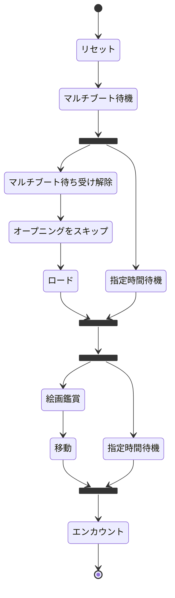

# ThirdGenPictureSeed

絵画seed乱数調整の自動化（Poke-Controller MODIFIED用）

## インストール

`Poke-Controller-Modified/SerialController/Commands/PythonCommands/`以下にcloneしてください。

```sh
git clone --depth=1 https://github.com/mukai1011/ThirdGenPictureSeed.git
```

## 動作の解説


