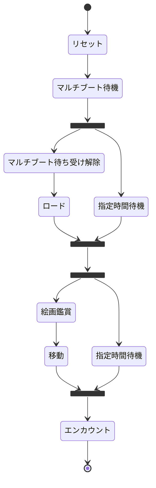

# picture_seed_rng

絵画seed乱数調整の自動化（Poke-Controller MODIFIED用）

## インストール

`Poke-Controller-Modified/SerialController/Commands/PythonCommands/`以下に`git clone`してください。

```sh
# Poke-Controller-Modifiedのルートにいる場合
git clone --depth=1 https://github.com/mukai1011/picture_seed_rng.git ./SerialController/Commands/PythonCommands/picture_seed_rng
```

## 使い方

`picture_seed_rng`フォルダごとコピーして、`operations.py`の`run`メソッドを書き換えてください。

コマンド名やコメントを変更するには、`main.py`を確認してください。

## 動作の解説


